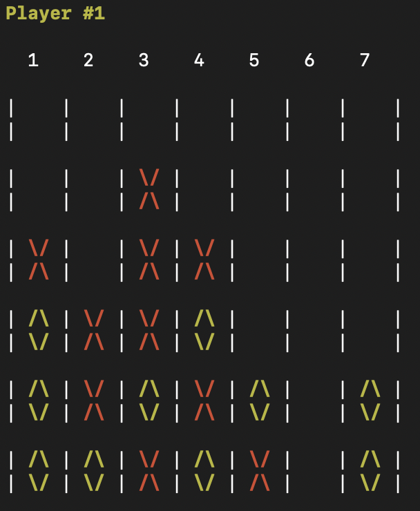

# Connect Four Game

Final project from University course on C.

Fully made in C.

Your opponent plays using the Minimax algorithm.

Game:
* Choose a column from 1 to 7 where you want to drop yellow circle.
* The first to form a horizontal, vertical, or diagonal line of four of one's own tokens wins.

Compile: ``` make main ```

Run: ``` ./main ```


